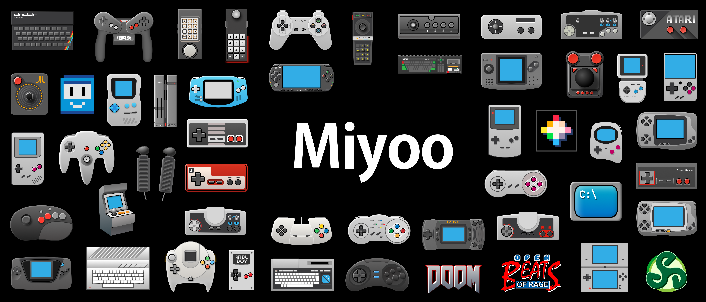

> last update 2024-10-25  
> [中文说明](./README_zh.md)

# Cosy

A theme for Miyoo Mini/Mini+ (with [OnionOS](https://github.com/OnionUI/Onion)) device.  
Based on another theme named [Wireframe](https://github.com/KyleBing/onion-theme-wireframe).


## Preview


## Files

```bash
.
├── BootImage                 # boot image for MiyooMini+ app Miyoo-Mini-easy-logotweak to use, can change MiyooMini+'s boot image
├── Preview                   # some preview images
└── Cosy by KyleBing          # original theme folder

```

## Install

Your device os need to be Onion.

1. Download this theme zip file
2. Copy zip file to TF card, path is `/Theme`
3. Insert TF card back to device, select menu: `Apps` `Themes`, found theme named Wireframe and install it.
4. Done


## About boot image

You can change boot image by using this app for MiyooMini+

> [https://github.com/schmurtzm/Miyoo-Mini-easy-logotweak](https://github.com/schmurtzm/Miyoo-Mini-easy-logotweak)

Boot image for this theme is placed in `/BootImage` Folder. You will know what to do after read the README in upper repository.


## Credits

**Nunwen Font:** by tenlevels (merged Nunito by Vernon Adams and wqy-microhei from Miyoo)  
**Icons:** by KyleBing  
**Console icons:** by KyleBing  
**Proofreading:** SundownerSport


## Other Preview


